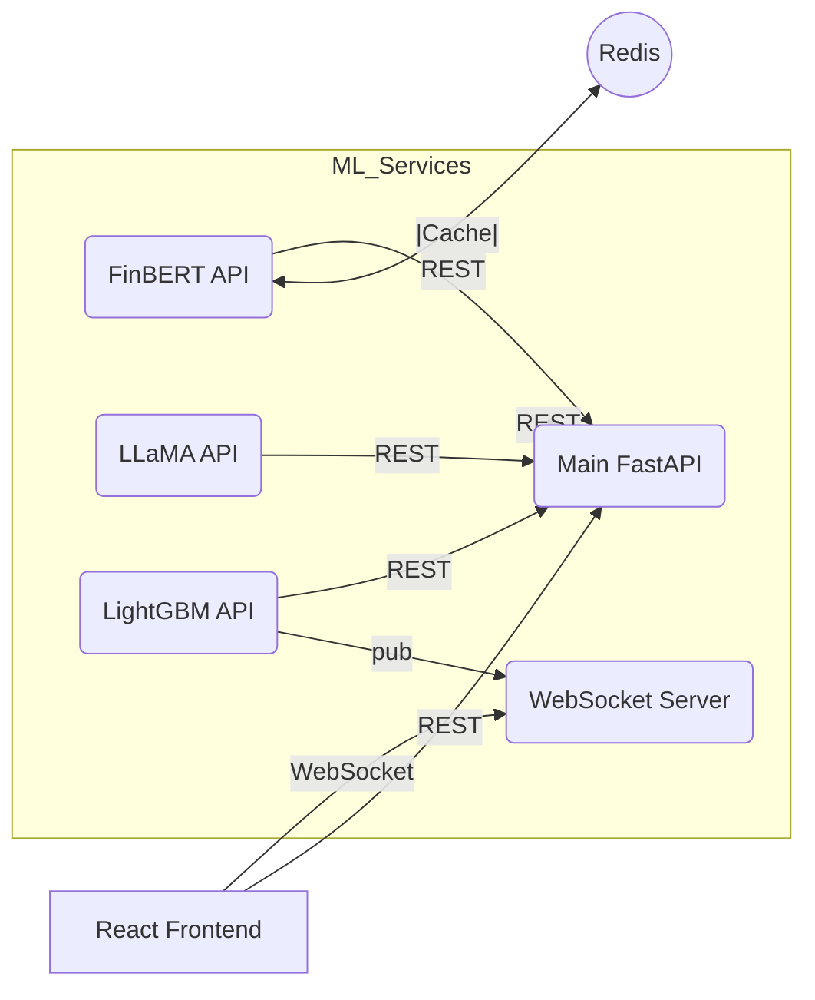

# NexusSentinel ‑ ML Services Suite

This directory contains **all machine-learning micro-services** that extend the core NexusSentinel platform with advanced AI capabilities such as financial sentiment analysis, trading-signal generation and price forecasting.  
Each service is **self-contained, independently deployable**, and exposed over **FastAPI** so that the main application (`app/`) can consume them through simple REST calls or message streams.

---

## 1 . Why a Separate `ml_services/` Layer?

| Goal | Benefit |
|------|---------|
| Resource isolation | Heavy models (e.g. LLaMA-3 on GPU) live outside the core API so they don’t hog memory/CPU. |
| Independent scaling | Scale only the bottleneck service (e.g. sentiment) without touching others. |
| Polyglot freedom | Each container can pin its own Python / CUDA / library versions. |
| Fast iteration | Re-train or A/B test a model by swapping its image tag without redeploying the whole stack. |

---

## 2 . Service Catalogue

| Folder | Port | Model | Purpose |
|--------|------|-------|---------|
| `sentiment_service/` | `8000` | FinBERT | Real-time, finance-tuned sentiment + Redis cache |
| `llama3_sentiment_service/` | `8001` | LLaMA-3 8B (8-bit) | Deeper nuance: sarcasm, context tone (GPU) |
| `signal_generator/` | `8002` | LightGBM | Turns features into **BUY/HOLD/SELL** probabilities |
| `price_forecast_service/` *(optional)* | `8003` | Temporal Fusion Transformer | Multi-horizon price forecasting |
| `websocket_signal_server/` | `8004` | n/a | Broadcast live signals to the React UI |
| `infra_redis_zmq/` | 6379 / 5556 | Redis + ZeroMQ | Caching and high-throughput pub/sub backbone |

> Only `sentiment_service/` is fully implemented in the initial commit. Others follow the **same layout** (`main.py`, `requirements.txt`, `Dockerfile`).

---

## 3 . Directory Layout

```
ml_services/
├── sentiment_service/
│   ├── Dockerfile
│   ├── requirements.txt
│   └── main.py
├── llama3_sentiment_service/
├── signal_generator/
├── price_forecast_service/
├── websocket_signal_server/
└── infra_redis_zmq/
```

---

## 4 . How the Pieces Talk


* `API_GW` = new endpoints in `app/api/v1/endpoints/enhanced_sentiment.py`.  
* Redis is shared (declared once in `docker-compose.yml`).

---

## 5 . Running Locally

### Prerequisites
* Docker ≥ 24  
* (If you want LLaMA) NVIDIA GPU + `nvidia-docker` runtime.

### Quick start

```bash
# from repository root
docker compose up -d sentiment_service redis      # start only FinBERT for now
# or bring up everything (GPU required for LLaMA):
docker compose --profile full up -d
```

Check health:

```bash
curl -s http://localhost:8000/health | jq
```

### Example request

```bash
curl -X POST http://localhost:8000/sentiment \
     -H "Content-Type: application/json" \
     -d '{"text":"AAPL unveils record earnings!"}'
```

---

## 6 . Google Cloud Deployment

1. **Container registry**  
   ```bash
   gcloud builds submit ml_services/sentiment_service \
          --tag gcr.io/$PROJECT_ID/sentiment-service:latest
   ```
2. **Cloud Run (simple)** – good for CPU FinBERT.  
   ```bash
   gcloud run deploy sentiment-service \
          --image gcr.io/$PROJECT_ID/sentiment-service:latest \
          --cpu 2 --memory 4Gi --port 8000
   ```
3. **GKE + GPU node-pool** – required for LLaMA.  
   *Add a tainted GPU node pool and schedule `llama3_sentiment_service` with tolerations.*

4. **Memorystore** – drop-in replacement for local Redis:
   * set `REDIS_HOST` to your Memorystore private IP.

---

## 7 . Environment Variables

| Variable | Default | Description |
|----------|---------|-------------|
| `REDIS_HOST` | `redis` | Redis host (service name in compose) |
| `REDIS_PORT` | `6379` | Redis port |
| `REDIS_CACHE_TTL` | `3600` | Seconds before a cached sentiment expires |
| `MODEL_CACHE_SIZE` | `100` | LRU cache size inside service |

---

## 8 . Health & Monitoring

* Every service exposes `/health` returning JSON component status.  
* Add Prometheus scraping on `<service>:<port>/metrics` once you integrate `prometheus-fastapi-instrumentator`.

---

## 9 . Extending with New Models

1. **Copy template**

```bash
cp -r sentiment_service new_model_service
```

2. Replace `model.py` / logic, update `requirements.txt`.
3. Add a block to `docker-compose.yml` (and optionally a Cloud Build file).
4. Create/modify proxy endpoint in `app/api/v1/endpoints/`.

---

## 10 . Frequently Asked Questions

**Q: Do I have to delete the old `stocks_sentiment.py`?**  
A: No. The legacy code stays; the gateway decides whether to serve legacy or enhanced sentiment.

**Q: Can I bypass Redis?**  
A: Yes – set `cache=false` in the request or change `REDIS_HOST=off` to disable caching.

**Q: LLaMA is slow on my laptop.**  
A: Deploy only FinBERT locally; run LLaMA in Cloud Run with a GPU or on GKE.

---

## 11 . Roadmap

- [ ] Finish `llama3_sentiment_service/`
- [ ] Implement `signal_generator/` with LightGBM
- [ ] Add `price_forecast_service/` (TFT)
- [ ] WebSocket broadcaster
- [ ] Triton Inference Server for dynamic batching
- [ ] Prometheus & Grafana dashboards

---

Happy hacking!  
*— NexusSentinel AI Team*  
